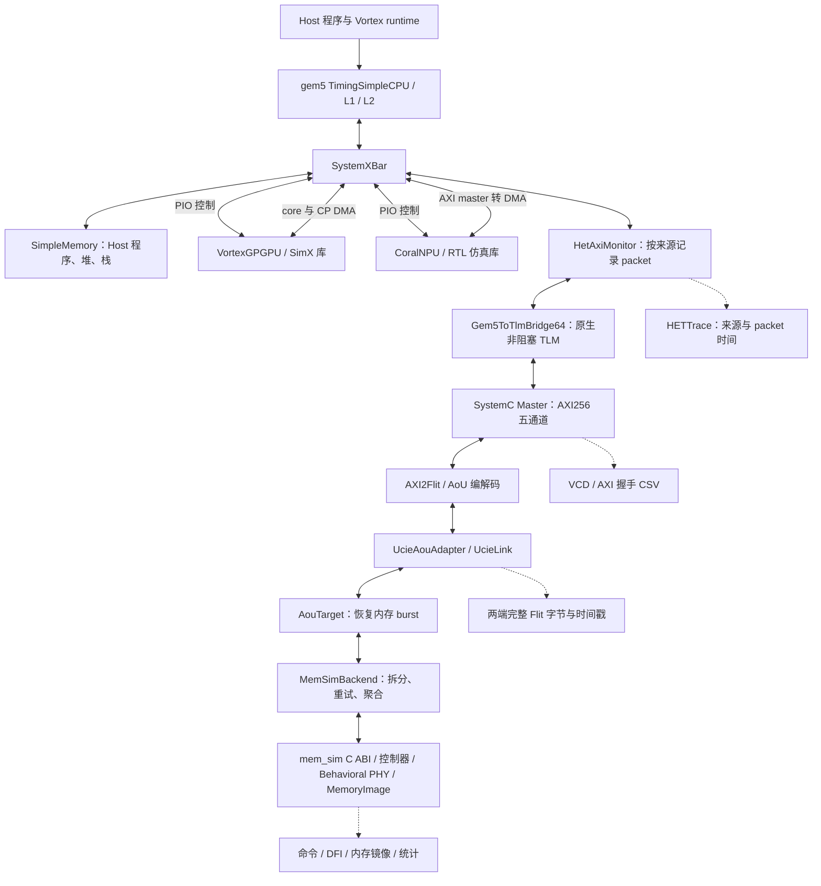

# 统一仿真器详细架构

本文以当前 Docker 交付版的 [run_xpu.py](../gem5_axi/configs/run_xpu.py)、
[AxiDemo](../gem5_axi/axi_demo.cc) 和 [在线内存桥](../gem5_axi/memsim_backend.cc)
为准。构建见[构建与运行](build-run.md)，任务交接见[多设备协同](multi-device.md)，
测量与结论边界见[实验分析](experiments.md)。

## 1. 系统层级

CPU/XPU 验收在**一个 gem5 进程**内完成：gem5 主事件队列调度 CPU、设备和内置
SystemC；在线 mem_sim 的真实数据与完成时刻经原链路返回请求方。没有独立运行的
SystemC 内核或通过文件回放才能完成的设备请求。

图中的双向箭头包含请求与响应；Host 的普通页池和设备 PIO 是分支，不经过在线存储链。
目标数据窗口才进入 monitor→TLM→AXI→UCIe→mem_sim。不能将 Host 全部取指、栈访问
计入堆叠存储流量。`Gem5ToTlmBridge64` 的名称表示 TLM socket 类型，实际 AXI
`WDATA/RDATA=256 bit`、`WSTRB=32 bit`。

## 2. 模块职责与源码入口

| 层级 | 模块与源码 | 输入、输出与职责 |
|---|---|---|
| 环境与实验 | [env/](../env/README.md)、[Dockerfile](../Dockerfile) | 获取固定依赖、构建、启动独立用例、记录环境与验收状态 |
| 系统组装 | [run_xpu.py](../gem5_axi/configs/run_xpu.py)、[run.py](../gem5_axi/configs/run.py) | 选择源、地址窗口、时钟、队列、后端；创建唯一 SystemC_Kernel |
| Host/设备前端 | [设备源码](../gem5_new/gem5int/src/dev/)、[het_system.py](../gem5_new/gem5int/configs/het/het_system.py) | Host 执行程序；设备接受 PIO 命令；外存访问通过 timing DMA 发出 |
| 统一观察点 | [HetAxiMonitor](../gem5_new/gem5int/src/hettrace/het_axi_monitor.cc) | 转发成功接受的 packet、重试与响应，按 requestor 分类，记录统一时间 |
| Packet→TLM | gem5 `src/systemc/tlm_bridge/`；[本地补丁入口](../gem5_axi/scripts/patch_gem5.py) | 保留数据、byte enable、请求来源和有效到达延迟；完成映射回 Packet |
| TLM→AXI | [axi_master.cc](../gem5_axi/axi_master.cc)、[axi_signals.hh](../gem5_axi/axi_signals.hh) | 有界准入、ID 分配、burst 拆分、五通道握手、末响应聚合 |
| AXI→AoU | [aou_backend.cc](../gem5_axi/aou_backend.cc)、[axi2flit/systemc/](../axi2flit/systemc/) | 原生 32 B lane 连接、请求/响应打包、资源平面路由 |
| 共享格式 | [aou_format6.h](../protocol/include/aou_format6.h) | AXI2Flit 与 UCIe 共用帧字段定义，避免两套编码漂移 |
| 链路 | [ucie-model/](../ucie-model/README.md) | 链路训练、发送/接收、CRC 与 replay；保留两端完整记录 |
| 存储桥 | [memsim_backend.cc](../gem5_axi/memsim_backend.cc) | burst→32 B 边界内子请求；入口满时重试；等待真实完成；返回原 AXI ID |
| 内存模型 | [online.cpp](../mem_sim/integration/online.cpp)、[在线接口说明](../mem_sim/integration/README.md) | 单一 MemoryImage、控制器排队/调度/刷新、原生命令、行为 PHY、HostResponse |
| 独立核验 | [scripts/](../gem5_axi/scripts/)、[verify_memsim.py](../env/verify_memsim.py)、[verify_xpu.py](../env/verify_xpu.py) | 从 VCD、Flit、AXI、子请求、命令与最终字节交叉验证，生成汇总 |

设备封装的维护源是 `gem5_new/gem5int/src/dev`；构建时复制到外部 gem5。
Vortex 使用手工维护的 SimX，CoralNPU 使用 RTL 仿真库，两者建模精度不同。
Vortex 内部 Ramulator 仍是编译依赖，当前整机外存响应由在线 mem_sim 提供。

## 3. 从启动到排空

1. `env/activate.sh` 设置工具链及库路径；构建/运行入口核对三个外部 revision。
2. 配置脚本在 instantiate 前设置 `m5.ticks.setGlobalFrequency('1fs')`，实例化
   Host、PIO/DMA、桥、AXI/AoU/UCIe 和在线内存；所有模块共享 gem5 时间轴。
3. 设备 `startup()` 加载动态库和程序。NPU ELF/本地复位初始化在正式设备计时前完成；
   Host 模式下 GPU/NPU 初始空闲，等待 Host 提交。UCIe 达到 Active/Degraded 后释放 AXI 复位。
4. Host 初始化目标数据并提交任务；设备在各自 gem5 时钟事件中推进。等待外存时保留
   上下文，真实返回才触发后续执行，不能由设备库自行循环推进第二条时间轴。
5. Host 校验设备结果并结束；脚本调用 `system.axi.finish()`，输出末拍 VCD 和模型统计。
   检查在途事务与响应排空、命令/DFI 合法性，再运行离线校验。

## 4. 一笔请求的完整生命周期

以 Host/NPU 写目标缓冲区为例：

1. gem5 packet 被 monitor 接受，记录来源；bridge 转成 TLM `BEGIN_REQ`。
   Master 等待有效到达时间、payload 延迟及空闲 slot。恰好在 AXI 上升沿到达的请求
   留到下一个可准入沿，不在同沿提前握手。
2. Master 为父事务分配存活期间独占的 AXI ID。长包按最多 256 beats、4 KiB 边界及
   对齐要求拆成 INCR burst；同一父事务的 burst 串行，不同父事务可并发。
3. AW 与 W 分别握手。W 没有 ID，按已接受的 AW 顺序归属；byte enable 转 WSTRB。
   AXI2Flit 将字段、mask 和数据编码到 AoU 帧，经 UCIe 正向发送。
4. AouTarget 恢复完整 burst；MemSimBackend 检查窗口并减去窗口基址，按原生 32 B
   粒度拆成子请求。`ss_mem_submit=0` 表示未接管，应保留同一请求重试；`1` 才记为接受。
5. 每个原生模型周期调用一次 `ss_mem_step`。控制器/PHY/MemoryImage 产生真实
   HostResponse 后 `ss_mem_pop` 取回；全部子请求完成后才能聚合父 burst 响应。
6. 响应经 AouTarget→UCIe 反向→AXI2Flit，形成 B；读请求对应 R 数据与 RLAST。
   Master 等到父事务最后的 R/B，再发 TLM `BEGIN_RESP`。`END_RESP` 后释放 slot/ID。
   bridge 返回 gem5 packet，设备 completion 或 Host 指令才能继续。

容量不足产生自然反压：mem_sim 队列满→子请求重试→burst 槽满→目标 FIFO/链路拥塞
→AXI READY 降低→上游等待。响应路径当前采用全局 FIFO，比同 ID 有序更严格，可能导致
队头阻塞。`stalls` 和 `response_hold` 则是额外协议压力开关，分析性能时必须记录其状态。

越界请求在桥侧返回 DECERR，不提交内存子请求；内存正常/已纠错状态映射 OKAY，其余
错误映射 SLVERR。完整错误传播能力仍以各设备适配器支持的子集为准。

### 一笔实测写请求

2026-09-22 复验 `results/docs-review-20260922/memsim/cpu/` 的第一笔请求，将
`0x11` 写到 `0x90000000`，长度 1 B、mask=1，父 AXI ID=1、内存子请求 ID=1。
`transactions.csv` 与 `memsim_journeys.json` 可得到下面的时间线：

| 事件 | 全局时间 ns | 原始证据 |
|---|---:|---|
| TLM 请求生效 / 准入 | 79 / 80 | `begin_tick` / `accepted_tick` |
| AW / W 握手 | 82 / 86 | `axi_events.csv` |
| 写地址帧到达内存端 | 92.000048 | `ucie_mem.csv`，正向 seq=5 |
| 写数据帧到达内存端 | 97.333424 | `ucie_mem.csv`，正向 seq=6 |
| 内存桥接受并提交 | 98.25 | `memsim_bridge.csv` 的 accept/submit |
| 原生 WR 命令 | 106.25 | `issued_cycle=425`，每 cycle=0.25 ns |
| 原生完成 / 桥返回 | 111.75 | `completion_cycle=447`，complete/return |
| 写响应帧发送 / 到达 SoC | 114.000128 / 120.000176 | 反向 seq=5，两端 Flit 日志 |
| B 握手 / TLM END_RESP | 128 / 128 | `axi_done_tick` / `end_resp_tick` |

这笔父事务延迟为 49 ns，内存提交到完成为 13.5 ns；其余时间包含准入、转换、链路与
AXI 采样等待。反向帧到达后也要等待 AXI 握手，不能把 111.75 ns 的内存完成点当作
CPU 已收到响应。不同方向的 Flit seq 各自编号；TLM、AXI、原生内存的状态枚举也各有
定义，不按同一整数值直接比较。

## 5. 时间、数据与观察口径

| 对象 | 当前口径 |
|---|---|
| 全局时间 | `1 tick = 1 fs`；`ns = tick / 10^6`；SystemC 采样断言与 `curTick()` 相等 |
| 默认时钟 | Host 2 GHz、Vortex 1 GHz、CoralNPU 500 MHz、AXI 周期 2 ns；以内嵌配置和 `config.ini` 为准 |
| 内存时间 | `period_fs = tCK_ps × 1000 × scale / tick_multiplier`；子响应不得早于 `completion_cycle × period_fs` |
| `memsim-scale` | 放大内存时间映射，原生 DRAM 参数不变；是敏感度实验，不是某款器件的速度档 |
| 数据所有者 | 在线 mem_sim 的唯一 MemoryImage；桥只暂存请求/响应，不维护另一份权威影子内存 |
| HETTrace | packet 投影，`level=interconnect`、`SYNTH=true`；当前 XPU 配置默认投影宽度 16 B，不是下游 AXI256 引脚记录 |
| 原生 AXI | `axi_wave.vcd` 与 `axi_events.csv` 才记录实际五通道握手；ID 可复用，不能仅凭 ID 跨整段日志关联 |
| Flit | `ucie_soc.csv`、`ucie_mem.csv`、`ucie_flits.csv` 包含完整字节、方向、事件、重传次数与 fs 时间 |
| DRAM/DFI | 从实际发出的模型命令生成；不等同于外部 RTL PHY 的引脚级签核 |

不能用 HETTrace 数据拍数、AXI burst 数、内存子请求数互相替代。父请求和完整时间段
关联方法见[实验指标](experiments.md)。

## 6. 与 LLM 入口及旧架构的区别

`./docker/run.sh memsim` 和 `xpu` 使用上述在线闭环；`./docker/run.sh llm` 则运行
`generate_trace.py → HETTrace convert → hbm_sim → compare_results.py`，是合成固定到达流，
不执行三个真实处理器的 LLM 数值计算，也不向设备反馈响应。

`gem5_new/docs/07-architecture.md` 等 2026-09-08 文档保留了旧功能内存加离线重放的
设计。当前整体架构以本页为准。现阶段尚无通用 functional/atomic、checkpoint、
跨设备缓存一致性、NPU 重复启动、GPU↔NPU 直接共享 workload；HBM4 含 provisional
时序，不能由功能 PASS 推出硬件精度或完整协议符合性。
