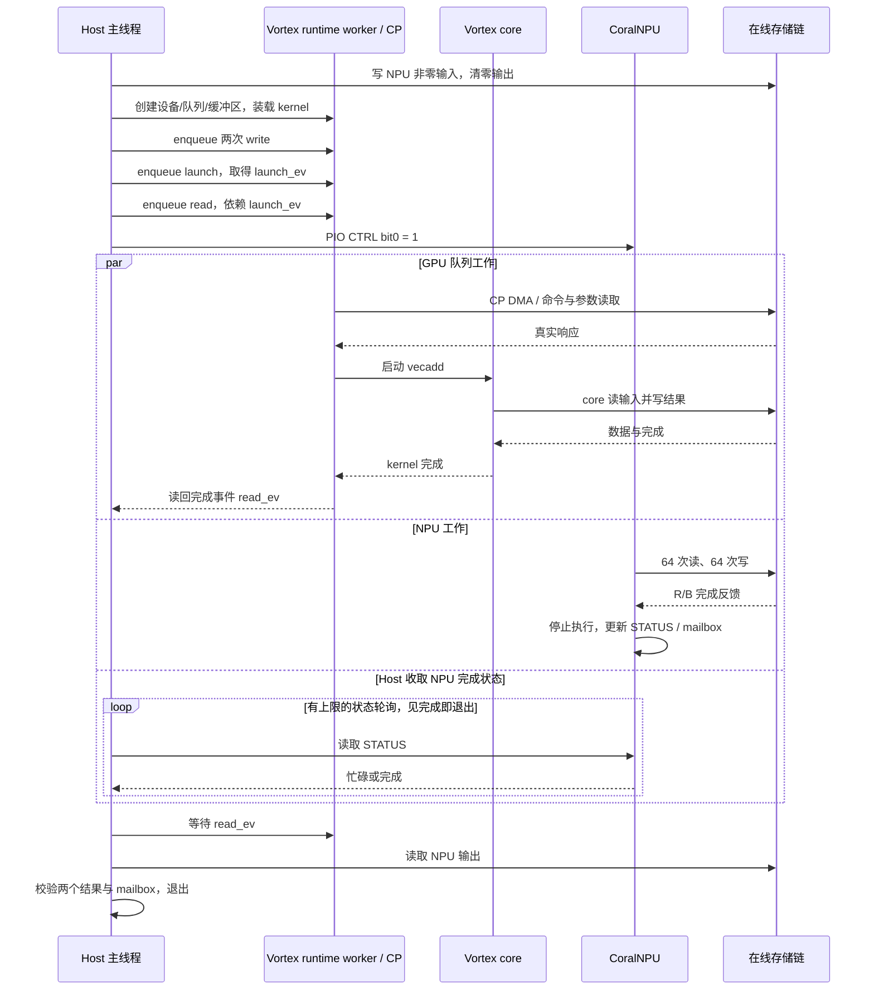

# Host、Vortex 与 CoralNPU 协同机制

当前协同由 Host 程序显式安排：为 GPU 和 NPU 准备不同的输入，异步提交 GPU 任务后启动
NPU，等待并分别校验两个结果。尚无自动划分算子的调度器，也没有 GPU 结果直接送入 NPU
的已验收流水线。统一存储链和时钟见[架构](architecture.md)。

## 1. 各方分工

| 角色 | 具体职责 | 控制与数据接口 |
|---|---|---|
| Host / gem5 TimingSimpleCPU | 初始化缓冲区、创建 GPU 对象/队列、提交任务、启动 NPU、等待事件/状态、核验数据 | CPU 访存、GPU runtime、PIO |
| Vortex / SimX | CP 解析队列命令、DMA 搬运、运行 vecadd；core 和 CP 的外存请求都等待真实响应 | `VortexGPGPU` PIO 与 timing DMA；`timing_memory=True` |
| CoralNPU / RTL | 从共享区读 64 个输入，执行 `out[i]=in[i]*2+1`，写结果和完成 mailbox | `CoralNPU` PIO 与 AXI-master→DMA；`share_memory=True` |
| gem5 + 存储链 | 路由、统一时间、排队/反压、协议转换、真实数据与完成反馈 | SystemXBar→TLM→AXI256→AoU/UCIe→mem_sim |

源码起点是 [three_source/host_main.cpp](../gem5_new/workloads/three_source/host_main.cpp)、
[ddr_touch.cc](../gem5_new/coralnpuint/ddr_touch.cc) 和
[run_xpu.py](../gem5_axi/configs/run_xpu.py)。Host 源码顶部的早期周期数属于旧配置注释；
本轮测量以[实验分析](experiments.md)和实际 `run.log` 为准。

## 2. 地址、数据所有权与可见性

| 区域 | Host 物理地址 | 访问关系与用途 |
|---|---|---|
| Host 页池 | `0x80000000`，256 MiB | 程序/堆/栈在本地 SimpleMemory；正常 CPU cache 路径 |
| NPU 交接区 | `0x90000000`，256 MiB | Host+NPU；样例输入 `0x90000000`、输出 `0x90001000` |
| NPU 工作区 | `0xb0000000`，256 MiB | Host+NPU 可访问目标区 |
| Vortex CP | `0x20000000`，设备寄存器 0x200 B | Host PIO；Host 按页映射 |
| NPU PIO | `0x30000000`，组装时映射 4 KiB | CTRL/STATUS/ENTRY/EMITTED/mailbox；有效控制寄存器位于前 0x20 B |
| Vortex BAR | `0x100000000`，4 GiB | Host+GPU，`host_pa = 0x100000000 + gpu_device_addr` |

常量及生成物维护入口是 [addrmap.json](../gem5_new/addrmap.json)；实际在线路由以
`run_xpu.py` 和 `het_system.py:map_device_windows()` 为准。
该 JSON 保留旧 trace 的默认时间元数据；在线运行显式使用 `10^15 ticks/s`，不能直接
套用旧默认值换算当前记录。

Host 的 PIO、NPU 数据区、GPU BAR 都映射为 `cacheable=False`，使目标数据直接进入共同
响应路径；这不构成缓存一致性协议。控制窗口只传寄存器状态，不是经过 UCIe 的数据流。
NPU 的内部 `npu_slave=0x10000000` 是 TCM/加载接口，`npu_mailbox=0xc0000000` 是设备
内部 mailbox 语义，都不能当作又一段在线 DRAM。

GPU/NPU 目标字节由在线 mem_sim 持有。GPU 使用 BAR 重定位后的地址，NPU AXI 地址仅
32 bit，无法表示 4 GiB 以上 BAR；当前不存在三方共同访问同一物理数据区的机制。
若将来做 GPU→NPU 数据依赖，需 Host 在已完成的 GPU 读回后搬运到 NPU 可寻址区，或
另行设计地址转换及一致性；这些均不是现有样例已经实现的能力。

## 3. 三源样例的完整工作链路

这是**异步提交关系**；两个 kernel 是否同时占用计算单元、具体重叠多久，应从来源时间和
设备事件测量，不能由图中的 `par` 或 Host 提交顺序推导吞吐提升。GPU runtime 的每个
队列有 worker 线程，当前配置至少需 2 个 CPU 上下文，默认 4 个；增加上下文不是自动
增加 GPU 核数，也不自动把 NPU 任务分摊给更多 CPU。

输入固定为 `pattern(i)=0x1000*(i+1)+(i^0x5a)`。NPU 检查 64 个结果及 mailbox
`tag=0x600d,sum=0x17e0`；GPU 处理 4 个 float 元素，检查精确的整数可表示结果。
NPU 轮询上限为 2,000,000 次；GPU 完成由 runtime 事件给出，整例另有 `max-ticks`
限制。通过两条 Host↔设备的数据交接，不等于实现设备之间的直接共享。

## 4. 完成、顺序与反压

Vortex core 的 timing 请求持有 token 和数据，gem5 DMA completion 后调用库的
`complete_core_memory`；CP 的 timing 读写保留 continuation，等待 DMA 才继续解析。
因此命令描述符和输入未返回时，不能提前启动依赖它们的工作。

CoralNPU 保存 AXI read/write 上下文、byte mask 与 ID，将外访存送入 gem5 DMA；
只有真实 completion 到达，才注入 RTL R/B。设备由 `clockEdge(Cycles(1))` 驱动，
halt/wfi 后停止周期事件；`exit_on_complete=False`，最终退出由 Host 决定。
当前 NPU 一次仿真仅允许启动一次，第二次 CTRL 启动会被拒绝。

下游延迟和队列反压会自然延长等待。`three_slow` 将内存时间映射放大，验收器要求
相同 NPU 访问序列、相同 GPU core 读写计数、计算结果正确且 Host/NPU/GPU 完成均变慢。
Host/CP 轮询请求数可能变化，不能强制要求所有三源请求总数在任意参数下恒定。

## 5. 如何验证协同而非只看设备各自 PASS

运行 `./docker/run.sh xpu` 后，至少联合检查：

1. `run.log` 的 NPU/vecadd 功能结果、mailbox 及 Host 正常退出原因。
2. `hettrace/` 中 host/vortex/coralnpu 均有事务，来源不被误分类，时间统一且请求/响应闭合。
3. `transactions.csv` 与 HETTrace 请求数及字节一致；原生 AXI、Flit、mem_sim 数据检查通过。
4. `wave_audit/summary.json` 的真实 VCD 保持/握手校验通过。
5. `summary.json.memory_feedback` 确认慢速内存反馈到设备周期和 Host 结束时间。

当前没有动态任务分配、抢占、通用 OS 驱动、多次 NPU launch、设备间直接缓存一致性。
后续更大计算、Host 中转流水线和调度策略必须新增 workload 与对应结果分析，不能仅修改
架构图即视为已经完成。
